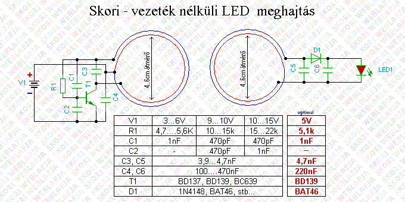
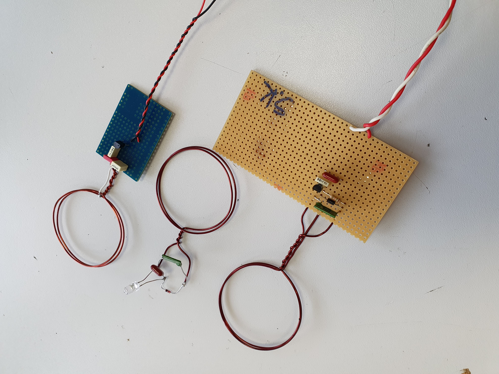

# Projekt 02 
Elkészült: 2022.02.10.

## Skori [ Vezeték Nélküli LED meghajtó ] építése / mérése

[VISSZA](https://sandorpeteer.github.io/portfolio/)

## Az elkészült áramköreim többféle verzióban is:

## Az általam választott alkatrész értékek, 12V tápfeszültségre méretezve:

|Név|Jelölés|Érték|darab|
|----|----|----|------|
|Ellenállás|R1|18k|1|
|Kondenzátor|C1|470pF|1|
|Kondenzátor|C2|1nF|1|
|Kondenzátor|C3,C4|4,7nF|2|
|Kondenzátor|C5,C6|470nF|2|
|Tranzisztor|T1|BC639|1|
|Dióda|D1|1n4148|1|

### A kapcsolás megépítéséhez Skori rajzát használtuk fel. 

[Forrás](http://skory.gylcomp.hu/kapcs/kapcs.html)
